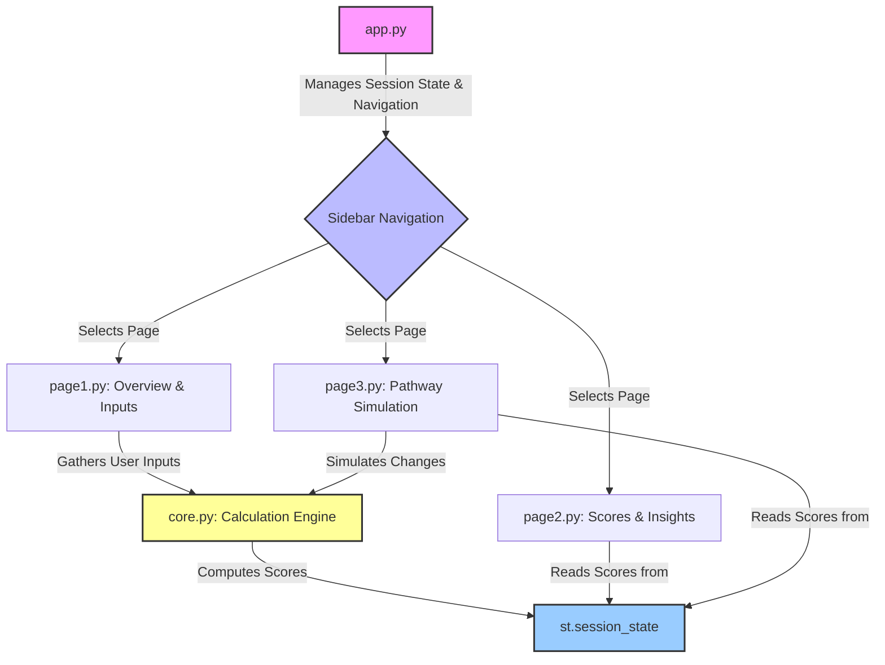

id: 68f63eb9833967484a12dd11_documentation
summary: AI-Readiness score - GPT-5 Documentation
feedback link: https://docs.google.com/forms/d/e/1FAIpQLSfWkOK-in_bMMoHSZfcIvAeO58PAH9wrDqcxnJABHaxiDqhSA/viewform?usp=sf_link
environments: Web
status: Published
# Understanding the AI-Readiness Score Application

## Introduction to the AI-Readiness Framework
Duration: 10:00

In this codelab, you will deconstruct a Streamlit application designed to calculate and simulate an individual's "AI-Readiness Score" (AI-R). This score is a comprehensive metric that helps professionals understand their preparedness for a career landscape increasingly shaped by artificial intelligence.

The application is built on a structured, data-driven framework that quantifies career readiness by blending three critical components:

1.  **Idiosyncratic Readiness ($V^R$)**: This measures your personal capabilities, skills, and adaptability. It's about who *you* are.
2.  **Systematic Opportunity ($H^R$)**: This evaluates the external market conditions for a specific career path you choose. It's about the *job market*.
3.  **Synergy**: This component provides a bonus for the alignment between your personal skills and the market's demands at a specific point in time.

The overall AI-Readiness Score is computed using the following formula:

$$ AI\text{-}R_{i,t} = \alpha\, V^R_i(t) + (1-\alpha)\, H^R_i(t) + \beta\, \text{Synergy}\% $$

Where:
- $V^R$: Your individual readiness score.
- $H^R$: The market opportunity score for your chosen occupation.
- $\alpha$: A weight to balance the importance of individual factors versus market factors.
- $\beta$: A coefficient that scales the impact of the Synergy component.

This codelab will guide you through the application's architecture, core calculation logic, and user interface, providing a complete understanding of how these concepts are implemented in a functional Streamlit application.

### Application Architecture

The application is structured into a main entry point and a modular `application_pages` package. This design separates the core logic from the user interface presentation for each page.



## Project Setup and Code Structure
Duration: 5:00

The application's code is organized for clarity and maintainability. Let's review the key files.

-   **`app.py`**: This is the main script that runs the Streamlit application. Its primary responsibilities are:
    -   Configuring the page layout and title.
    -   Initializing the `st.session_state` with synthetic dataframes (`_init_state` function). This state management is crucial for passing data between pages.
    -   Creating the sidebar navigation and global parameter sliders for $\alpha$ and $\beta$.
    -   Routing the user to the appropriate page module based on the navigation selection.

-   **`application_pages/`**: This directory is a Python package containing the logic for each page and the core calculations.
    -   **`core.py`**: This is the heart of the application. It contains all the pure Python functions that perform the mathematical calculations for $V^R$, $H^R$, Synergy, and the final AI-R score. It has no Streamlit-specific code, making it testable and reusable.
    -   **`page1.py`, `page2.py`, `page3.py`**: Each file corresponds to a page in the application. They are responsible for rendering the UI using Streamlit components and calling the necessary functions from `core.py`.

### The Main Application File (`app.py`)

The `app.py` script sets the stage. The `_init_state` function loads several `pandas` DataFrames into the session state. These dataframes provide the synthetic data for individual profiles, occupations, skills, and learning pathways, allowing the application to be fully interactive without a database.

```python
# app.py

import streamlit as st
import pandas as pd
import numpy as np

# Page configuration and branding
st.set_page_config(page_title="QuLab", layout="wide")
st.sidebar.image("https://www.quantuniversity.com/assets/img/logo5.jpg")
st.sidebar.divider()
st.title("QuLab")
st.divider()

# Intro/business logic explanation
st.markdown(...)
st.latex(...)
st.markdown(...)

def _init_state():
    if "initialized" in st.session_state:
        return

    # Synthetic DataFrames are loaded here
    st.session_state.individual_profiles_df = pd.DataFrame(...)
    st.session_state.occupational_data_df = pd.DataFrame(...)
    # ... and so on for other dataframes

    st.session_state.initialized = True

_init_state()

# Sidebar global controls for Navigation and Global Parameters
page = st.sidebar.selectbox(label="Navigation", options=["Overview & Inputs", "Scores & Insights", "Pathway Simulation"])
st.sidebar.subheader("Global Parameters")
st.sidebar.slider("Weight on Individual Factors (\\u03B1)", ..., key="alpha_weight")
st.sidebar.slider("Synergy Coefficient (\\u03B2)", ..., key="beta_weight")

# Route to pages
if page == "Overview & Inputs":
    from application_pages.page1 import run_page1
    run_page1()
elif page == "Scores & Insights":
    from application_pages.page2 import run_page2
    run_page2()
elif page == "Pathway Simulation":
    from application_pages.page3 import run_page3
    run_page3()
```

<aside class="positive">
Using <b>`st.session_state`</b> is a best practice in multi-page Streamlit apps. It provides a persistent state dictionary that allows variables and data to be shared across user interactions and page re-runs without using global variables.
</aside>

## Understanding Idiosyncratic Readiness ($V^R$)
Duration: 15:00

Idiosyncratic Readiness ($V^R$) quantifies an individual's personal capabilities. It is calculated as a weighted average of three core pillars: **AI-Fluency**, **Domain-Expertise**, and **Adaptive-Capacity**.

$$ V^R = w_1 \cdot \text{AI-Fluency} + w_2 \cdot \text{Domain-Expertise} + w_3 \cdot \text{Adaptive-Capacity} $$

The application uses weights of $w_1=0.45$, $w_2=0.35$, and $w_3=0.20$ respectively.

### $V^R$ Calculation Flow

```mermaid
graph TD
    subgraph AI-Fluency
        S1[S1: Technical AI Skills]
        S2[S2: AI-Augmented Productivity]
        S3[S3: Critical AI Judgment]
        S4[S4: AI Learning Velocity]
    end

    subgraph Domain-Expertise
        E1[Education Foundation]
        E2[Practical Experience]
        E3[Specialization Depth]
    end

    subgraph Adaptive-Capacity
        A1[Cognitive Flexibility]
        A2[Social-Emotional Intelligence]
        A3[Strategic Career Management]
    end

    I1[User Inputs] --> S1 & S2 & S3 & S4
    I2[User Inputs] --> E1 & E2 & E3
    I3[User Inputs] --> A1 & A2 & A3

    S1 & S2 & S3 & S4 --> AF[AI-Fluency Score]
    E1 & E2 & E3 --> DE[Domain-Expertise Score]
    A1 & A2 & A3 --> AC[Adaptive-Capacity Score]

    AF & DE & AC --> VR[Idiosyncratic Readiness (V^R) Score]
```

### AI-Fluency

AI-Fluency is a composite score derived from four sub-metrics, each capturing a different aspect of AI competence.

-   **$S_1$: Technical AI Skills**: The average of scores for prompting, tool usage, conceptual understanding, and data literacy.
    ```python
    # application_pages/core.py
    def calculate_technical_ai_skills(prompting, tools, understanding, data_lit):
        return (float(prompting) + float(tools) + float(understanding) + float(data_lit)) / 4.0
    ```
-   **$S_2$: AI-Augmented Productivity**: A ratio measuring the productivity gain from using AI, considering both quality and time.
    ```python
    # application_pages/core.py
    def calculate_ai_augmented_productivity(output_quality_with_ai, output_quality_without_ai, time_without_ai, time_with_ai):
        return (oq_wa / oq_woa) * (t_woa / t_wa)
    ```
-   **$S_3$: Critical AI Judgment**: Measures the ability to correctly evaluate and trust AI outputs.
    ```python
    # application_pages/core.py
    def calculate_critical_ai_judgment(errors_caught, total_ai_errors, appropriate_trust_decisions, total_decisions):
        # ... logic to calculate judgment score
    ```
-   **$S_4$: AI Learning Velocity**: Quantifies the rate of proficiency gain per hour of investment.
    ```python
    # application_pages/core.py
    def calculate_ai_learning_velocity(delta_proficiency, delta_t_hours_invested):
        return dp / dt
    ```

These four scores are combined in a weighted sum to produce the final AI-Fluency score.

```python
# application_pages/core.py
def calculate_ai_fluency(s1, s2, s3, s4):
    return 0.1 * s1c + 0.2 * s2c + 0.3 * s3c + 0.4 * s4c
```

### Domain-Expertise & Adaptive-Capacity

Similarly, **Domain-Expertise** is calculated from education level, years of experience, and specialization scores (portfolio, recognition, credentials). **Adaptive-Capacity** is the normalized average of cognitive flexibility, social-emotional intelligence, and strategic career management scores.

All these individual calculations are brought together in the `calculate_idiosyncratic_readiness` function, which produces a final score normalized to a range of [0, 1]. This is later scaled to [0, 100] for display.

## Understanding Systematic Opportunity ($H^R$)
Duration: 15:00

Systematic Opportunity ($H^R$) assesses the attractiveness of the external job market for a chosen occupation. It is not about the individual, but about the role itself. The calculation starts with a **Base Opportunity Score ($H_{\text{base}}$)**, which is then adjusted by **Growth** and **Regional** multipliers.

$$ H^R = H_{\text{base}} \cdot M_{\text{growth}} \cdot M_{\text{regional}} $$

### $H^R$ Calculation Flow

```mermaid
graph TD
    subgraph H_base
        H1[AI Enhancement Potential]
        H2[Job Growth Projection]
        H3[Wage Premium]
        H4[Entry Accessibility]
    end

    subgraph Multipliers
        M1[Growth Multiplier]
        M2[Regional Multiplier]
    end

    I1[Occupation Data] --> H1 & H2 & H3 & H4
    I2[Occupation Data] --> M1 & M2

    H1 & H2 & H3 & H4 --> HB[Base Opportunity Score (H_base)]
    HB & M1 & M2 --> HR[Systematic Opportunity (H^R) Score]
```

### Base Opportunity Score ($H_{\text{base}}$)

This is a weighted sum of four factors derived from the `occupational_data_df` DataFrame:

-   **AI Enhancement Potential**: The degree to which AI can augment tasks in the occupation.
-   **Job Growth Projection**: The projected growth rate for the job.
-   **Wage Premium**: The additional income earned by professionals with AI skills in this role compared to the median.
    ```python
    # application_pages/core.py
    def calculate_wage_premium(ai_skilled_wage, median_wage):
        return (float(ai_skilled_wage) - mw) / mw
    ```
-   **Entry Accessibility**: An inverse measure of the barrier to entry (required education and experience).
    ```python
    # application_pages/core.py
    def calculate_entry_accessibility(education_years_required, experience_years_required):
        return 1.0 / (1.0 + 0.1 * (e_yrs + exp_yrs))
    ```

These factors are combined in the `calculate_base_opportunity_score` function.

### Market Multipliers

The base score is then adjusted to reflect current market dynamics:

-   **Growth Multiplier ($M_{\text{growth}}$)**: This captures the short-term momentum of the job market by comparing current vs. previous job postings. The $\lambda$ parameter dampens the volatility of this ratio.
    $$ M_{\text{growth}} = \left(\frac{\text{current postings}}{\text{previous postings}}\right)^\lambda $$
-   **Regional Multiplier ($M_{\text{regional}}$)**: This adjusts the score based on local demand relative to the national average and the potential for remote work. The $\gamma$ parameter controls the sensitivity to regional factors.

The final $H^R$ score is calculated by `calculate_systematic_opportunity`, which multiplies these three parts together. The result is clamped to a [0, 1] range and then scaled to [0, 100] for display.

## The Synergy Component
Duration: 10:00

The Synergy component rewards the alignment between your individual readiness ($V^R$) and the market opportunity ($H^R$). A high $V^R$ is most valuable when it's directed at a high $H^R$ role for which you are a good fit.

The calculation is based on an **Alignment Factor**, which itself is derived from a **Skills Match Score** and a **Timing Factor**.

$$ \text{Synergy}\% = \frac{V^R \cdot H^R \cdot \text{Alignment Factor}}{100} $$

### Skills Match Score

This is the most detailed part of the Synergy calculation. The `calculate_skills_match_score` function performs the following steps:
1.  It takes the user's list of skills and their self-assessed scores.
2.  It takes the list of required skills, target scores, and importance weights for the selected occupation.
3.  It merges these two lists to find the common skills.
4.  For each common skill, it calculates a weighted score: `min(your_score, required_score) * importance_weight`.
5.  It sums these weighted scores and normalizes by the total importance of all required skills.

This produces a score from 0 to 100 representing how well your skills match the job requirements.

```python
# application_pages/core.py
def calculate_skills_match_score(user_skills_df, required_skills_df):
    # ... pandas merge and iteration logic ...
    merged_df = pd.merge(user_skills_df, required_skills_df, on='skill_name', how='inner')
    # ...
    for _, row in merged_df.iterrows():
        weighted_sum += (min(row['individual_skill_score'], row['required_skill_score']) / 100.0) * row['skill_importance']
    return (weighted_sum / total_importance) * 100.0
```

### Timing and Alignment

-   **Timing Factor**: This provides a small bonus for experience, acknowledging that timing in a career matters. It's calculated as $1 + (\text{years\_experience} / 5)$.
-   **Alignment Factor**: This combines the skills match and timing: `(skills_match_score / max_possible_match) * timing_factor`.

These components are brought together in `calculate_synergy_percentage` to calculate the final value that is added to the AI-R score.

## Exploring the UI: Inputs and Calculation (page1.py)
Duration: 10:00

The **"Overview & Inputs"** page, managed by `application_pages/page1.py`, serves as the main control panel for the user. It uses various Streamlit widgets to collect all the parameters needed for the AI-R calculation.

The page is organized into tabs for a clean user experience:
-   **Idiosyncratic Readiness ($V^R$)**: Contains sliders and number inputs for all sub-components of AI-Fluency, Domain-Expertise, and Adaptive-Capacity.
-   **Systematic Opportunity ($H^R$)**: Features a select box for the target occupation and sliders for the $\lambda$ and $\gamma$ multipliers.
-   **Synergy Inputs**: Includes a `st.data_editor` for managing the user's personal skills and a number input for the `max_possible_match` value.

### Calculation Trigger

At the bottom of the page, a prominent "Calculate AI-Readiness" button triggers the entire computation pipeline.

```python
# application_pages/page1.py

if st.button("Calculate AI-Readiness"):
    try:
        # 1. Get selected occupation and required skills
        occ_row = _get_selected_occupation_row(...)
        required_skills_df = st.session_state.occupation_required_skills_df[...]

        # 2. Collect all inputs from st.session_state into a dictionary
        inputs = {
            'prompting_score': st.session_state.prompting_score,
            'years_experience': st.session_state.years_experience,
            'occupation_row': occ_row,
            'individual_skills_df': st.session_state.individual_skills_df.copy(),
            'required_skills_df': required_skills_df.copy(),
            'alpha': st.session_state.alpha_weight,
            'beta': st.session_state.beta_weight,
            # ... and all other inputs
        }

        # 3. Call the central orchestrator function from core.py
        with st.spinner("Calculating..."):
            results = compute_all_scores(inputs)

        # 4. Store the complete results dictionary in the session state
        st.session_state.current_scores = results
        st.success("Scores computed. Navigate to 'Scores & Insights' for visualizations.")
    except Exception as e:
        st.error(f"Error computing scores: {e}")
```

<aside class="negative">
The application handles potential <b>`ZeroDivisionError`</b> exceptions within the core functions, for example, when calculating learning velocity with zero hours invested. However, the UI layer also wraps the main call in a `try...except` block as a best practice to catch any unexpected errors during calculation and display a friendly message to the user.
</aside>

## Visualizing Results: Scores and Insights (page2.py)
Duration: 5:00

The **"Scores & Insights"** page is dedicated to visualizing the results computed on the first page. It's a read-only view that provides a deeper understanding of the score's composition.

Its logic is straightforward:
1.  Check if `st.session_state.current_scores` exists. If not, display a message prompting the user to calculate their score first.
2.  If scores are present, unpack the dictionary.
3.  Display the four key metrics ($V^R, H^R, \text{Synergy}\%, AI\text{-}R$) using `st.metric`.
4.  Create and display visualizations using `plotly.express`.

### Key Visualizations

-   **$V^R$ Composition**: A bar chart showing the weighted contribution of AI-Fluency, Domain-Expertise, and Adaptive-Capacity to the final $V^R$ score. This helps users quickly identify their strongest and weakest areas.
-   **$H_{\text{base}}$ Components**: A bar chart that breaks down the Base Opportunity Score, showing the relative contributions of AI Enhancement, Job Growth, etc., for the selected occupation.
-   **Detailed Numbers**: An expandable section (`st.expander`) shows the raw JSON/dictionary output of the score breakdowns for developers or users who want to see the precise numbers.

```python
# application_pages/page2.py

def run_page2():
    st.subheader("AI-Readiness Scores & Insights")
    cs = st.session_state.get('current_scores', None)
    if cs is None:
        st.info("No scores computed yet...")
        return

    # Display top-level metrics
    c1, c2, c3, c4 = st.columns(4)
    c1.metric("V^R (0-100)", f"{cs['vr_score']:.1f}")
    # ... other metrics

    # V^R Composition (weighted shares)
    vr_vals = {
        'AI-Fluency': cs['vr_breakdown']['AI-Fluency (01)'] * 0.45,
        'Domain-Expertise': cs['vr_breakdown']['Domain-Expertise (01)'] * 0.35,
        'Adaptive-Capacity': cs['vr_breakdown']['Adaptive-Capacity (01)'] * 0.20,
    }
    vr_df = pd.DataFrame(...)
    fig_vr = px.bar(vr_df, ..., title='V^R Composition (weighted, normalized)')
    st.plotly_chart(fig_vr, use_container_width=True)
    # ... other charts
```

## "What-If" Analysis: Pathway Simulation (page3.py)
Duration: 10:00

The **"Pathway Simulation"** page provides a powerful "what-if" analysis tool. It allows users to see the potential impact of completing a learning pathway on their AI-Readiness Score.

The core assumption of the simulation is that completing a learning pathway primarily affects the user's **Idiosyncratic Readiness ($V^R$)**. The market opportunity ($H^R$) and the user's skill alignment are held constant for the simulation.

### Simulation Logic

The `page3.py` script executes the following steps:
1.  **Get Baseline**: It retrieves the user's current scores from `st.session_state.current_scores`. If no baseline exists, it calculates one from the current inputs on-the-fly.
2.  **User Input**: It prompts the user to select a learning pathway from `learning_pathways_df` and specify their expected completion and mastery scores (from 0 to 1).
3.  **Apply Impact**: It calls the `simulate_pathway_impact` function from `core.py`. This function takes the current $V^R$ components (AI-Fluency, Domain-Expertise, Adaptive-Capacity) and adds the impact from the selected pathway.
    ```python
    # application_pages/core.py
    def simulate_pathway_impact(current_ai_fluency, ..., impact_ai_fluency, ...):
        ai_fluency = float(current_ai_fluency) + float(impact_ai_fluency) * completion_score * mastery_score
        # ... and so on for other components, clamping result to [0,1]
        return clamp01(ai_fluency), clamp01(domain_expertise), clamp01(adaptive_capacity)
    ```
4.  **Recompute Scores**: With the new, projected $V^R$ components, it re-calculates the final $V^R$ score. It then re-calculates the Synergy% and the final AI-R score using the new $V^R$ and the original $H^R$.
5.  **Display Comparison**: It presents the results using `st.metric` with deltas and a grouped bar chart from Plotly, showing the "Current" vs. "Projected" scores side-by-side.

This feature transforms the application from a static assessment tool into a dynamic career planning assistant, helping users make informed decisions about their upskilling journey.

## Conclusion and Next Steps
Duration: 5:00

You have now explored the complete architecture and functionality of the QuLab AI-Readiness Streamlit application. You've seen how it:
-   Implements a complex, multi-faceted scoring framework in a modular way.
-   Uses a central `core.py` module for testable business logic.
-   Manages application state across pages with `st.session_state`.
-   Provides an interactive UI for data input and "what-if" simulation.
-   Visualizes results effectively using Plotly charts.

### Potential Enhancements

This application serves as a strong foundation. A developer could extend it in several ways:
-   **Real-Time Data Integration**: Replace the synthetic `occupational_data_df` with data from a live jobs API (like LinkedIn or Indeed) to provide real-time market opportunity scores.
-   **User Authentication and Storage**: Implement user accounts to allow individuals to save their profiles, track their scores over time, and persist their skill sets.
-   **Advanced Pathway Recommendation**: Instead of just simulating, build a recommendation engine that suggests the most impactful learning pathways based on a user's current scores and career goals.
-   **Detailed Skill Gap Analysis**: Enhance the Synergy component to provide a detailed breakdown of which required skills a user is missing or needs to improve the most.
