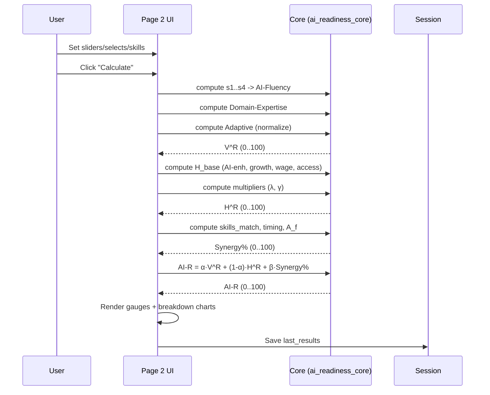

id: 68f63eb9833967484a12dd11_documentation
summary: AI-Readiness score - GPT-5 Documentation
feedback link: https://docs.google.com/forms/d/e/1FAIpQLSfWkOK-in_bMMoHSZfcIvAeO58PAH9wrDqcxnJABHaxiDqhSA/viewform?usp=sf_link
environments: Web
status: Published
# QuLab: AI Career Navigator & Pathway Planner — Developer Codelab

## 1) Why this app matters and what you’ll learn
Duration: 03:00

This codelab walks you through QuLab, an interactive Streamlit application that quantifies a person’s AI-Readiness (AI-R) for AI-enabled careers. The app combines individual capability (Idiosyncratic Readiness, $V^R$), market opportunity (Systematic Opportunity, $H^R$), and skill-role alignment (Synergy%) to produce a single AI-R score. You’ll learn the end-to-end architecture, data model, computation pipeline, and UI/UX patterns used in building the app, and how to extend it.

Key concepts and value:
- AI-Readiness formula: $AI\text{-}R_{i,t} = \alpha \cdot V^R_i(t) + (1-\alpha) \cdot H^R_i(t) + \beta \cdot \text{Synergy}\%(V^R, H^R)$
- $V^R$: Combines AI-Fluency, Domain-Expertise, and Adaptive-Capacity into a normalized readiness score.
- $H^R$: Combines occupation-level AI-Enhancement, job growth, wage premium, entry accessibility, and labor-market multipliers.
- Synergy%: Captures alignment between user skills and target role skills, scaled by timing.
- Interactive exploration: Users can tune parameters, edit skills, and simulate learning pathways to see how AI-R evolves.

You will:
- Understand the app architecture, page structure, and state management.
- Learn the precise formulas and how they map to code.
- Run the app, interact with all pages, and generate insights through visualizations.
- Extend and customize data models, calculations, and UI components.

<aside class="positive">
This application provides an actionable, data-driven approach to career navigation in the age of AI. It’s also a clean example of modular Streamlit design, reusable computation kernels, and cross-page state management.
</aside>


## 2) Project structure and architecture overview
Duration: 04:00

File layout
- app.py: Entry point, global configuration, navigation, and session state initialization.
- application_pages/data_models.py: Synthetic datasets for profiles, occupations, learning pathways, and skills.
- application_pages/ai_readiness_core.py: Core computation functions for $V^R$, $H^R$, Synergy%, and AI-R; plus simulation helpers.
- application_pages/page1.py: Overview page that introduces the framework and shows sample datasets and a growth chart.
- application_pages/page2.py: AI-R Calculator with all inputs, the main “Calculate” flow, and diagnostic visualizations.
- application_pages/page3.py: Pathways & What-If Scenarios to project score changes after completing learning pathways.

High-level architecture (Mermaid)
```mermaid
flowchart TB
    A[User] -->|Streamlit UI| B[app.py]
    B --> C{Navigation}
    C -->|Page 1| D[Overview]
    C -->|Page 2| E[AI-R Calculator]
    C -->|Page 3| F[Pathways & Scenarios]

    B --> G[Session State]
    G <--> E
    G <--> F
    B --> H[data_models.get_initial_data()]
    H --> G

    E --> I[ai_readiness_core.py]
    F --> I

    subgraph DataFrames
    H --> J[individual_profiles_df]
    H --> K[occupational_data_df]
    H --> L[learning_pathways_df]
    H --> M[occupation_required_skills_df]
    H --> N[individual_skills_df]
    end
```

Data + compute flow (ASCII)
```
User Inputs (sliders, selects, table edits)
    -> Page 2: computes s1..s4 -> AI-Fluency
    -> Domain-Expertise + Adaptive-Capacity
    -> V^R -> H^R (occupation/multipliers) -> Synergy% (skills alignment)
    -> AI-R (alpha, beta)
    -> Visualizations (gauges, pies, bars)
    -> Persist results to session_state["last_results"]

Page 3:
    -> Load baseline from session_state["last_results"] (or compute baseline)
    -> Apply pathway impacts -> New V^R -> Synergy% -> AI-R
    -> Compare Current vs Projected
```

<aside class="negative">
If you skip running the Calculator (Page 2) before Pathways (Page 3), the app uses an approximate baseline for $H^R$. Run the Calculator first for precise projections.
</aside>


## 3) Setup and running the app
Duration: 03:00

Prerequisites
- Python 3.9+ recommended
- pip and virtual environment tool of your choice

Install and run
```bash
# from project root
python -m venv .venv
source .venv/bin/activate  # Windows: .venv\Scripts\activate

pip install streamlit pandas plotly
streamlit run app.py
```

Once running, use the left sidebar to navigate:
- Page 1 - Overview
- Page 2 - AI-R Calculator
- Page 3 - Pathways & Scenarios


## 4) Data models and defaults
Duration: 06:00

All default datasets are created in application_pages/data_models.py and loaded once in app.py into st.session_state. Key frames:

- individual_profiles_df (one default user)
  - AI-Fluency inputs: prompting_score, tools_score, understanding_score, datalit_score
  - Productivity and judgment inputs: output_quality_with_ai, output_quality_without_ai, time_without_ai, time_with_ai, errors_caught, total_ai_errors, appropriate_trust_decisions, total_decisions, delta_proficiency, delta_t_hours_invested
  - Domain-Expertise inputs: education_level, years_experience, portfolio_score, recognition_score, credentials_score
  - Adaptive-Capacity inputs: cognitive_flexibility, social_emotional_intelligence, strategic_career_management

- occupational_data_df
  - For each occupation: ai_enhancement_score, job_growth_rate_g, ai_skilled_wage, median_wage, education_years_required, experience_years_required, current_job_postings, previous_job_postings, remote_work_factor, local_demand, national_avg_demand

- learning_pathways_df
  - Each pathway has impacts on AI-Fluency, Domain-Expertise, and Adaptive-Capacity

- occupation_required_skills_df
  - Required skills per occupation with importance weighting

- individual_skills_df
  - User’s current skill levels

Editing or extending datasets:
- Add new occupations: append rows to occupational_data_df with all required fields.
- Add new pathways: include new rows with impact magnitudes in learning_pathways_df.
- Add required skills: add rows keyed by occupation_name.
- Update user skills: Page 2 provides an editable table that writes back to session state.

<aside class="positive">
Use consistent scales. The app expects:
- Most abilities as 0..1 floats (e.g., prompting_score), except Adaptive-Capacity sliders which are 0..100 and normalized internally.
- Skills use 0..100.
- Wages use absolute values; wage premium is computed as a ratio.
</aside>


## 5) Page 1 — Overview and datasets
Duration: 05:00

What you see:
- Introductory text, notation, and the AI-R formula with st.latex.
- Optional “Show Synthetic Datasets” expander with all default DataFrames.
- A quick visual: bar chart of job_growth_rate_g across occupations using Plotly Express.

Developer notes:
- The Overview page reads from st.session_state to display the same data used by other pages.
- Use this page to validate data loading and inspect synthetic inputs.

Sample visual code (page1.py):
```python
occ_df = st.session_state["occupational_data_df"].copy()
fig = px.bar(occ_df, x='occupation_name', y='job_growth_rate_g',
             title='Job Growth Rate by Occupation',
             labels={'job_growth_rate_g': 'Job Growth Rate (g)'})
st.plotly_chart(fig, use_container_width=True)
```


## 6) Math and core computations (ai_readiness_core.py)
Duration: 09:00

AI-Fluency sub-components:
- Technical AI Skills: $$S_{1} = \frac{p + t + u + d}{4}$$
- AI-Augmented Productivity: $$S_{2} = \frac{OQ_{AI}}{OQ_{\neg AI}} \cdot \frac{T_{\neg AI}}{T_{AI}}$$ with guards for zero denominators.
- Critical AI Judgment: $$S_{3} = 1 - \frac{1}{2}\left(\frac{\text{errors\_caught}}{\text{total\_ai\_errors}} + \frac{\text{appropriate\_trust\_decisions}}{\text{total\_decisions}}\right)$$
- AI Learning Velocity: $$S_{4} = \frac{\Delta \text{proficiency}}{\Delta t_{\text{hours}}}$$ with a ZeroDivisionError if hours are zero but proficiency changed.

AI-Fluency aggregate:
- $$AI\text{-}Fluency = 0.1\,S_1 + 0.2\,S_2 + 0.3\,S_3 + 0.4\,S_4$$

Domain-Expertise:
- Education foundation: categorical mapping to [0, 1]
- Practical experience: $$E_{\text{exp}} = \frac{y}{y + \frac{1}{\gamma}} \quad (y \ge 0)$$
- Specialization depth: mean of portfolio, recognition, credentials
- Aggregate: $$Domain = 0.125\,E_{\text{edu}} + 0.25\,E_{\text{exp}} + 0.625\,E_{\text{spec}}$$

Adaptive-Capacity:
- $$Adaptive = \text{mean}(\text{cognitive\_flexibility}, \text{social\_emotional\_intelligence}, \text{strategic\_career\_management}) / 100$$

Idiosyncratic Readiness:
- $$V^R = 0.45\cdot AI\text{-}Fluency + 0.35\cdot Domain + 0.20\cdot Adaptive$$
- Converted to 0..100 via clamp and scaling.

Systematic Opportunity:
- Job growth projection: $$J = \text{clamp}_{[0,100]}\left(50 + 100\cdot g\right)$$
- Wage premium: $$W = \frac{\text{wage}_{AI} - \text{wage}_{median}}{\text{wage}_{median}}$$
- Entry accessibility: $$A = \frac{1}{1 + 0.1(\text{edu\_yrs} + \text{exp\_yrs})}$$
- Base score: $$H_{\text{base}} = 0.30\,AI\_enh + 0.30\,\frac{J}{100} + 0.25\,W + 0.15\,A$$
- Multipliers:
  - Growth: $$M_g = \begin{cases} 1 & \text{if prev=0}\\ \left(\frac{\text{current}}{\text{previous}}\right)^{\lambda} & \text{otherwise}\end{cases}$$
  - Regional: $$M_r = 1 + \gamma\left(\frac{local}{national} + remote - 1\right)$$
- Combined: $$H^R = \text{clamp}_{[0,100]}(100 \cdot H_{\text{base}} \cdot M_g \cdot M_r)$$

Synergy:
- Skills match (0..100) is a weighted min between user and required skills normalized by importance weights.
- Timing factor: $$T = \begin{cases}1 & y \le 0\\ 1 + \frac{y}{5} & y>0\end{cases}$$
- Alignment factor: $$A_f = \frac{\text{skills\_match}}{\text{max\_possible\_match}} \cdot T$$ (clamped to [0, 2] in UI)
- Synergy%: $$\text{Synergy}\% = \frac{V^R \cdot H^R \cdot A_f}{100}$$

Final AI-Readiness:
- $$AI\text{-}R = \alpha \cdot V^R + (1-\alpha) \cdot H^R + \beta \cdot \text{Synergy}\%$$

Utilities:
- clamp_0_1, to_0_100_from_0_1 to keep values in expected ranges.

<aside class="negative">
Watch out for division by zero in $S_2$ and $S_4$. The code safeguards most cases and raises an explicit exception for invalid $S_4$.
</aside>


## 7) Page 2 — AI-Readiness Calculator walkthrough
Duration: 12:00

What it does:
- Lets users set global weights ($\alpha$, $\beta$).
- Collects inputs to compute $V^R$, $H^R$, and Synergy%.
- Produces gauges for $V^R$, $H^R$, Synergy%, and AI-R.
- Shows diagnostic breakdowns: a pie for $V^R$ components and a bar for $H_{\text{base}}$ components.

Global parameters:
- Alpha ($\alpha$): weight on $V^R$ vs $H^R$ in final AI-R.
- Beta ($\beta$): contribution of Synergy% to AI-R.

$V^R$ inputs:
- AI-Fluency tab: sliders for prompting, tools, understanding, data literacy; productivity and judgment; learning velocity inputs.
- Domain-Expertise tab: education level, years of experience, portfolio, recognition, credentials.
- Adaptive-Capacity tab: three 0..100 sliders averaged then scaled to 0..1 internally.

$H^R$ inputs:
- Target Occupation: choose from occupational_data_df.
- Multipliers: $\lambda$ (growth multiplier dampening), $\gamma$ (regional influence).

Synergy inputs:
- Required skills for the selected occupation: read-only table.
- Your skills: editable table via st.data_editor (add rows, update scores).
- Max Possible Skills Match: upper bound used in alignment factor.

Press “Calculate AI-Readiness”:
- Computes s1..s4, AI-Fluency, Domain, Adaptive, then $V^R$.
- Computes all $H^R$ components, multipliers, and $H^R$.
- Computes skills match, timing, alignment, Synergy%.
- Computes final AI-R using current $\alpha$, $\beta$.
- Writes results to st.session_state["last_results"] for Page 3.

Compute flow (Mermaid)


Visuals:
- Gauges for $V^R$, $H^R$, Synergy%, and AI-R.
- $V^R$ component pie chart (weights 0.45, 0.35, 0.20).
- $H_{\text{base}}$ component bar chart (weights 0.30, 0.30, 0.25, 0.15).

Error handling:
- Shows a Streamlit error box for ZeroDivisionError in learning velocity, or unexpected exceptions.

<aside class="positive">
Encourage users to run the Calculator at least once to set a precise baseline for Pathways simulations.
</aside>


## 8) Page 3 — Pathways & What-If Scenarios
Duration: 08:00

Purpose:
- Project how completing a learning pathway would change $V^R$, Synergy%, and AI-R.

Inputs:
- Select a pathway from learning_pathways_df.
- Completion and Mastery scores in [0, 1].

Simulation steps:
- Load baseline from st.session_state["last_results"]; if missing, compute a reasonable baseline from defaults.
- Apply simulate_pathway_impact:
  - $$AI\text{-}Fluency' = AI\text{-}Fluency + \Delta_{AF} \cdot \text{completion} \cdot \text{mastery}$$
  - $$Domain' = Domain + \Delta_{DE} \cdot \text{completion} \cdot \text{mastery}$$
  - $$Adaptive' = Adaptive + \Delta_{AC} \cdot \text{completion} \cdot \text{mastery}$$
  - Each capped at 1.0
- Recompute $V^R$ from updated components.
- Keep $H^R$ fixed for a simple simulation (you can extend this).
- Recompute Synergy% using the saved alignment factor.
- Recompute AI-R with the updated values.
- Render a grouped bar chart: Current vs Projected for $V^R$, $H^R$, Synergy, AI-R.
- Save projection to st.session_state["projection_results"].

Extending the simulation:
- Make $H^R$ responsive to pathway impacts that change “entry accessibility” or “experience_years_required”.
- Recompute skills match if a pathway adds specific skills.


## 9) Session state and cross-page behavior
Duration: 05:00

Initialized in app.py on first load:
- Data frames: individual_profiles_df, occupational_data_df, learning_pathways_df, occupation_required_skills_df, individual_skills_df
- Global params: alpha, beta, selected_occupation, lambda_val, gamma_val, max_possible_match
- last_results: stores the output of Page 2 for Page 3 to consume
- data_initialized flag

Keys used across pages:
- st.session_state["individual_skills_df"] is updated by st.data_editor on Page 2.
- st.session_state["last_results"] is set when Calculate completes on Page 2.
- st.session_state["projection_results"] is set by simulations on Page 3.

Best practices:
- Always read and write through st.session_state to keep pages in sync.
- Provide default values via setdefault or guarded access with .get to avoid KeyErrors.
- Store only serializable objects in state.


## 10) Customization and extensions
Duration: 07:00

Add a new occupation:
- Append a row in occupational_data_df with all required numeric fields.
- Optionally add new required skills for that occupation in occupation_required_skills_df.

Adjust component weights:
- Change weights in calculate_ai_fluency, calculate_domain_expertise, calculate_idiosyncratic_readiness, or calculate_base_opportunity_score.
- Surface weights as UI sliders if you want advanced tuning.

Enhance Synergy:
- Replace skills_match_score with a cosine similarity over embeddings or ontology-based matching.
- Add new fields like “skill decay” or “transferability” to alignment_factor.

Model richer $H^R$:
- Incorporate additional labor-market signals (volatility, automation resilience).
- Update multipliers with more nuanced geographic or remote work models.

Add new pathways:
- Insert rows into learning_pathways_df; tie pathways to specific skill deltas for dynamic skills matching if desired.

New pages:
- Add another entry to the sidebar selectbox and create corresponding page module to plug in analytics, cohort comparisons, or recommendations.


## 11) Testing core logic
Duration: 06:00

Unit testing ideas for ai_readiness_core.py:
- AI-Augmented Productivity: check behavior with zero denominators and typical ratios.
- AI Learning Velocity: expect ZeroDivisionError when Δproficiency > 0 and hours = 0.
- Practical Experience: confirm monotonic increase and asymptote behavior with different γ.
- Wage Premium and Entry Accessibility: validate ranges and edge cases.
- Job Growth Projection: ensure clamping at [0, 100].
- Skills Match: verify weighted average, empty merges, and importance sum guard.
- Synergy clamp: test alignment_factor capping at 2.0 and Synergy% clamping at [0, 100].
- AI-R compositing: property tests for α in [0,1], β in [0,1], and output range [0,100].

Example pytest scaffolding:
```python
def test_job_growth_projection():
    assert calculate_job_growth_projection(0.0) == 50
    assert calculate_job_growth_projection(0.5) == 100
    assert calculate_job_growth_projection(-1.0) == 0
```

<aside class="positive">
Decouple UI and computations: most logic is in ai_readiness_core.py and can be tested without Streamlit.
</aside>


## 12) Deployment and operations
Duration: 05:00

Local to cloud:
- Streamlit Community Cloud: push repo and deploy via UI.
- Containers: add a requirements.txt and Dockerfile; run with streamlit run app.py on a web port.

Production tips:
- Pin versions in requirements.txt for reproducibility.
- Cache heavy data or external calls using st.cache_data/st.cache_resource if introduced later.
- Validate user inputs and sanitize edited tables.
- Instrument with simple logging for debugging calculation paths.


## 13) Reference: UI snippets and patterns
Duration: 04:00

Gauges (Plotly):
```python
def gauge(title, value):
    fig = go.Figure(go.Indicator(
        mode="gauge+number",
        value=value,
        title={'text': title},
        gauge={'axis': {'range': [0, 100]}, 'bar': {'color': '#2C7BE5'}}
    ))
    fig.update_layout(height=280, margin=dict(l=10, r=10, t=40, b=10))
    return fig
```

Editable skills table:
```python
edited_skills_df = st.data_editor(
    st.session_state["individual_skills_df"],
    num_rows="dynamic",
    use_container_width=True,
    key="skills_editor"
)
st.session_state["individual_skills_df"] = edited_skills_df
```

Navigation:
```python
page = st.sidebar.selectbox("Navigation", [
    "Page 1 - Overview",
    "Page 2 - AI-R Calculator",
    "Page 3 - Pathways & Scenarios"
])
```


## 14) Checklist and next steps
Duration: 03:00

- Run Page 2 Calculator to set a baseline (saves to session state).
- Explore different occupations and parameter weights.
- Edit your skill profile to see how Synergy responds.
- Simulate learning pathways on Page 3 and compare outcomes.
- Extend datasets and weights to fit your domain.

<aside class="positive">
You now have a complete, modular blueprint for measuring and improving AI-Readiness. Adapt the data, tweak the formulas, and ship your own AI career navigator.
</aside>
